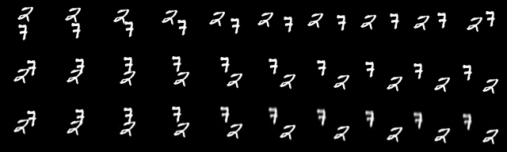
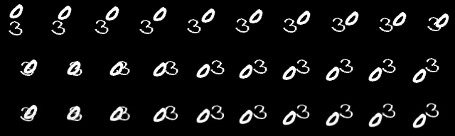

## Overview

LHFM  represents images as exact Lagrangian graphs and describes their evolution through Hamiltonian dynamics. This formulation separates image evolution into spatial transport and changes in channel values. A neural network jointly predicts the grid representations of the transport vector field and the source field, yielding the image velocity

```math
v_\theta(t,J)
= r_\theta(t,J)
- \left.DF_J\right|_{\mathcal{G}_N}u_\theta(t,J).
```

Here, $F_J$ is the continuous image representation and $DF_J$ is its spatial Jacobian. **LHFM-I** is trained using conditional flow matching, and images are generated by integrating the resulting image-space ordinary differential equation from Gaussian noise.

**LHFM-V** applies the transport–source formulation to deterministic video prediction. Given observed frames, it predicts future frames through

```math
\frac{dJ_s}{ds} = A(w_s)J_s + r_s^{\mathrm{net}},
\qquad w_s = N u_s,
```

where $s$ denotes video time, $w_s$ is the transport vector field in pixels per frame, and $A(w_s)$ discretizes spatial transport. With the fields held fixed over each half-frame interval, the numerical update approximates

```math
J_{s+h} = e^{hA(w_s)}J_s
+ \int_0^h e^{(h-\tau)A(w_s)}r_s^{\mathrm{net}}\,d\tau,
\qquad h = \frac{1}{2}.
```

Unlike LHFM-I, LHFM-V uses a supervised prediction loss, not a conditional flow-matching loss.

## Sampling preview

### LHFM-I · Image generation

<p align="center">
  
</p>

CIFAR-10 · 150k-step EMA checkpoint · Heun128 · 256 NFE.
[Preview provenance](assets/lhfm-i-cifar10-150k.json).

### LHFM-V · Video prediction

<p align="center">
  
  <br>
  
</p>

Moving MNIST · 1,250,000-step EMA checkpoint · 10 observed → 10 predicted frames.
Rows: observed frames, ground truth, predictions.
[Preview provenance](assets/lhfm-v-moving-mnist-1250k.json).

[LHFM-I: installation, training and sampling](docs/USAGE.md) ·
[LHFM-V: installation, training, prediction and results](docs/LHFM_V_USAGE.md)
