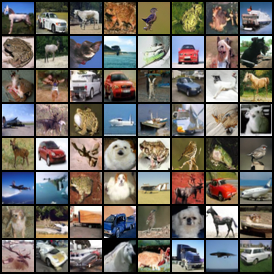

# LHFM-I

**Lagrangian--Hamiltonian Flow Matching for image generation.**

## Core formulation

An image $J$ is represented by an exact Lagrangian graph:

$$
F_J=\mathcal F_N(J),\qquad S_J(x,a)=a^\top F_J(x),\qquad
L_J=\operatorname{graph}(dS_J).
$$

Hamiltonian image dynamics induce transport and source terms:

$$
H_t(x,a;\xi,\eta)=\xi^\top U_t(x)-a^\top R_t(x),\qquad
\partial_tF_{J_t}=R_t-DF_{J_t}U_t.
$$

On the pixel grid, $u_\theta=U_\theta|_{\mathcal G_N}$ and
$r_\theta=R_\theta|_{\mathcal G_N}$. LHFM-I parameterizes

$$
u_\theta(t,J)=0.125\,t\,\tanh(\widetilde u_\theta(t,J)),\qquad
v_\theta(t,J)=r_\theta(t,J)-\left.DF_J\right|_{\mathcal G_N}u_\theta(t,J).
$$

Here $F_J$ is the full-band cosine extension, and $DF_J$ is its spatial Jacobian.
For independent $I\sim\nu_{\mathrm{data}}$, $\epsilon\sim\mathcal N(0,I_d)$,
and $t\sim\mathcal U(0,1)$, training uses

$$
J_t=(1-t)\epsilon+tI,\qquad
\mathcal L(\theta)=\frac{1}{d}\mathbb E\left[
\|v_\theta(t,J_t)-(I-\epsilon)\|_2^2\right],\qquad d=3N^2.
$$

Sampling integrates $\dot J_t=v_{\bar\theta}(t,J_t)$ from
$J_0\sim\mathcal N(0,I_d)$, using EMA parameters $\bar\theta$.

## Sampling preview

  

CIFAR-10 · 150k-step EMA checkpoint · Heun128 · 256 NFE.
Archived generated samples; not a new training run.
[Preview provenance](assets/lhfm-i-cifar10-150k.json).

[Installation, training and sampling](docs/USAGE.md)
